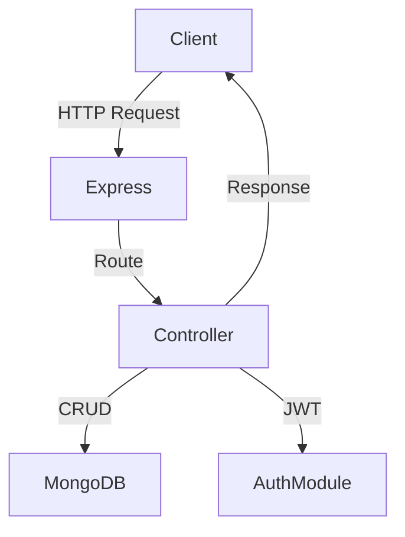

# Fluxcore

## Overview

Fluxcore is a lightweight and efficient RESTful API built with Node.js, Express, TypeScript, and MongoDB. It follows modern best practices—JWT-based authentication, input validation, Docker containerization, and automated port management—so you can focus on your business logic.

## Key Features

* **Health Check**: Simple endpoint to verify service health.
* **RESTful Architecture**: CRUD operations with clear routes.
* **JWT Authentication**: Secure token-based access.
* **MongoDB Integration**: Flexible NoSQL storage via Mongoose.
* **Input Validation**: Ensures request data integrity.
* **Docker Support**: Containerize your app for consistent deployments.
* **Automated Port Cleanup**: Avoid port conflicts in development.

## Tech Stack

* **Language:** TypeScript
* **Runtime:** Node.js, Express
* **Database:** MongoDB (Mongoose)
* **Authentication:** JWT, bcrypt.js
* **Dev Tools:** Nodemon, Jest, Supertest, OpenAPI Generator
* **Containerization:** Docker

## Getting Started

### Prerequisites

* Node.js v18 or above
* MongoDB (local or Atlas)
* Docker (optional)

### Installation

```bash
git clone https://github.com/Alexintw/Fluxcore.git
cd Fluxcore
npm install
```

### Environment Configuration

Copy the example file and fill in your values:

```bash
cp .env.example .env
```

```env
PORT=5000
MONGO_URI=<YOUR_MONGODB_CONNECTION_STRING>
JWT_SECRET=<YOUR_SECRET_KEY>
```

### Running the Application

* **Development Mode** (with auto-reload):

  ```bash
  npm run dev
  ```
* **Production Mode**:

  ```bash
  npm start
  ```

### Docker

```bash
docker build -t fluxcore .
docker run -p 5000:5000 --env-file .env fluxcore
```

## API Endpoints

| Method | Endpoint         | Description                |
| ------ | ---------------- | -------------------------- |
| GET    | `/health`        | Health check (returns 200) |
| GET    | `/api/users`     | Retrieve all users         |
| GET    | `/api/users/:id` | Retrieve a user by ID      |
| POST   | `/api/users`     | Create a new user          |
| PUT    | `/api/users/:id` | Update a user by ID        |
| DELETE | `/api/users/:id` | Delete a user by ID        |

## Project Structure

```
Fluxcore/
├── src/
│   ├── controllers/    # Request handlers
│   ├── models/         # Mongoose schemas
│   ├── routes/         # Express route definitions
│   ├── utils/          # Helpers and middleware
│   ├── healthcheck.ts  # Health endpoint
│   └── server.ts       # App entry point
├── clients/            # Auto-generated API clients
├── dist/               # Compiled output
├── Dockerfile
├── jest.config.js      # Jest configuration
├── tsconfig.json       # TypeScript configuration
├── .env.example
├── package.json
└── README.md
```

## Simple API Flow



## Testing

Run Jest + Supertest tests:

```bash
npm test
```

## Code Generation

Generate OpenAPI clients:

* **Python:**

  ```bash
  npm run gen:client:py
  ```
* **TypeScript (Axios):**

  ```bash
  npm run gen:client:ts
  ```

## Changelog

* **2025-07-02:** Initialized project and added core features.
* **2025-07-02:** Added health check endpoint and Supertest test.
* **2025-07-02:** Configured Jest, TypeScript, Docker and CI-friendly scripts.

## ⚠️ TypeScript Refactor in Progress

Run type checks before merging:

```bash
npm run check:types
```

## License

MIT

---

Built and maintained by [Alex Ko](https://github.com/Alexintw)
